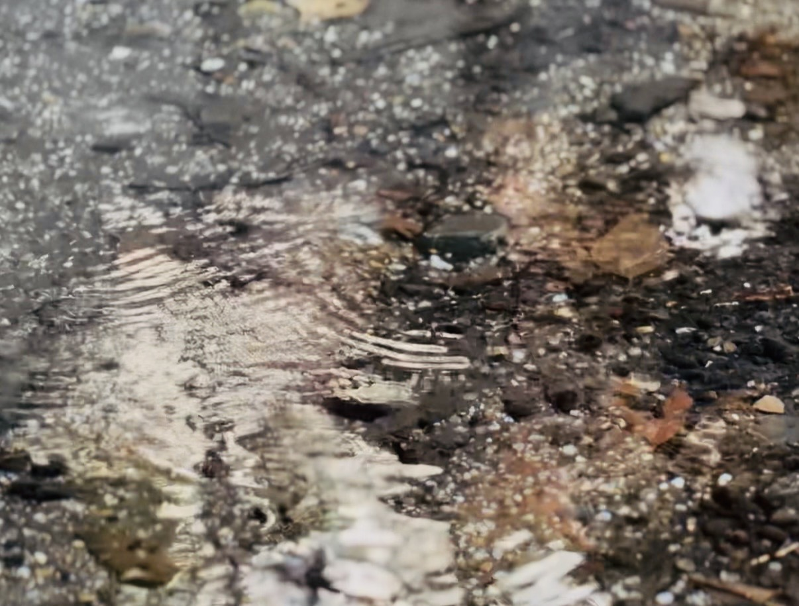

# Fukumoto Lab: 探究と教育の旅
**テーマ：水は誰のもの？見えない水をさがせ！**

## 概要
「水」と「鴨川」をテーマとしたラーニング・ジャーニー。
参加者が生物多様性の重要性を五感で体感し、その保全への行動へとつながるプログラムを設計・試行します。

## 参加者構成 (想定)
* **計12名程度**
* 親子連れ（あかりちゃん小4・小1、松田さん親子など）
* 探究系の先生 (2-3名)
* 生物好きの方々

## タイムライン & ルート (12/14 メモ)
* **09:00 - 16:00** (親子連れは16:30頃まで)
* **事前学習**: 京都市立図書館を活用
* **フィールドワーク**:
    * 京都御所南エリア
    * 下御霊神社（水と商い・お茶の歴史）
    * 梨木神社（染井の水）
    * 鴨川デルタ周辺（専門家による水辺の生き物観察）
* **午後**: 
    * 老松（お菓子の原材料と水）
    * 弘道館（15:00訪問予定、お茶と庭園）
* **16:30 -**: 振り返り・意見交換

## Research Log

*川の流れに反して、発生するアメンボの波紋*
### 2025-12-15: 下鴨神社リサーチ
福本理恵チームにて、下鴨神社（糺の森・御手洗川）を1時間ほど現地リサーチ。
#### 視点
- 水の湧き出し口、植生、歴史的背景の確認。
### 2025-12-18: 京料理 二傳リサーチ
  <a href="/iki-mono/journeys/nakahigashi/">research_niden.html</a>
ゆき＆りえ、お店訪問してヒアリング
#### 視点
- 魚でも海魚と川魚に別れる。佃煮を売ってる店は川魚が多い。
- 比叡山・鴨川の風土とお茶の文化の間で、日本料理はどう発展してきたか。
- 京料理と生物多様性。鴨川との結びつき、お茶との結びつき
- 鴨川との距離感。実際の当日ルート。
- 四季折々を庭や料理に取り入れる。
- 山の幸を運ぶ流域（水運）は鴨川。出汁を引く軟水も鴨川。
- 仕出分野と茶懐石の文化

